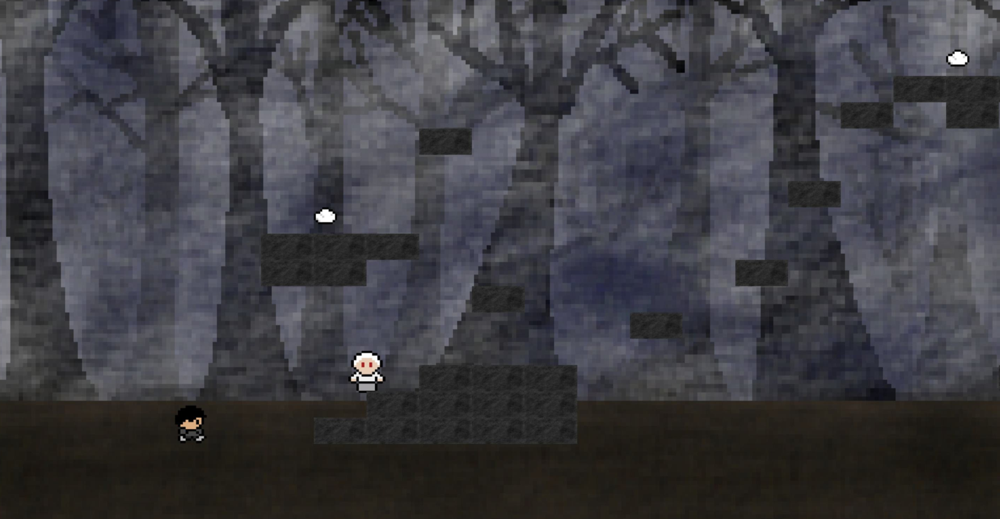
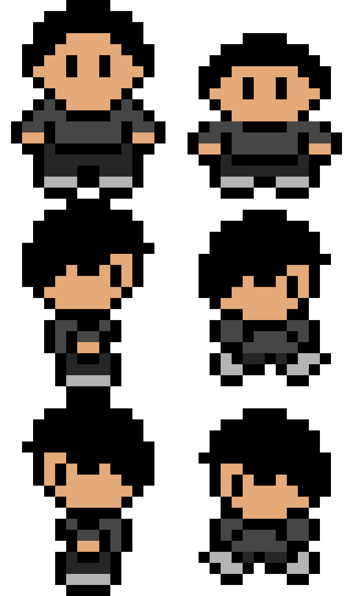
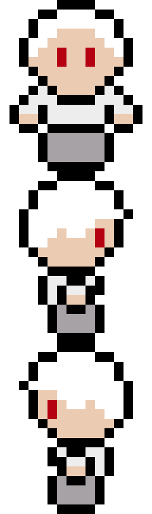

# **Boundless Echo** 

> Remember who you are, collect memories and wake up from the dream!

## 📸 **Screenshots**

### Main Gameplay:

  
  
*Figure 1: Example of gameplay in action.*

---

### Menu and UI:

  
  
*Figure 2: Menu and user interface.*

---

## **Spritesheets**
Below are the sprites used to create characters and objects in the game:

### Player:

  
  
*Figure 3: Player character animations.*

---

### Enemy:

  
  
*Figure 4: Enemy animations.*

---

## ✍️ **Reflection**

### What went well:
- **Debugging:** I solved a lot of issues really fast, sometimes I got help from the tutors.
- **Art:** While it was a challenge, I managed to draw stuff that I am satisfied with.

### Challenges:
- **Time Constraints:** I really underestimated how much time I have and could not fully implement the game the way I wanted to.
- **Runtime/ Deltatime issues:** Because of these issues the character could not spawn and it took a long time to figure out that this was the problem.

### Lessons Learned:
- **Realistic goals:** As my first game ever, I might have not only overestimated the time we had but also myself.
- **Ask for help early:** I was very eager and wanted to do and fix everything myself, which led to not having enough time anymore.
